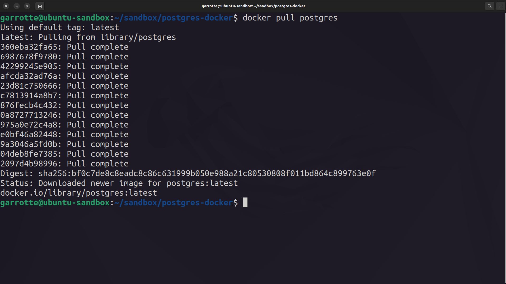
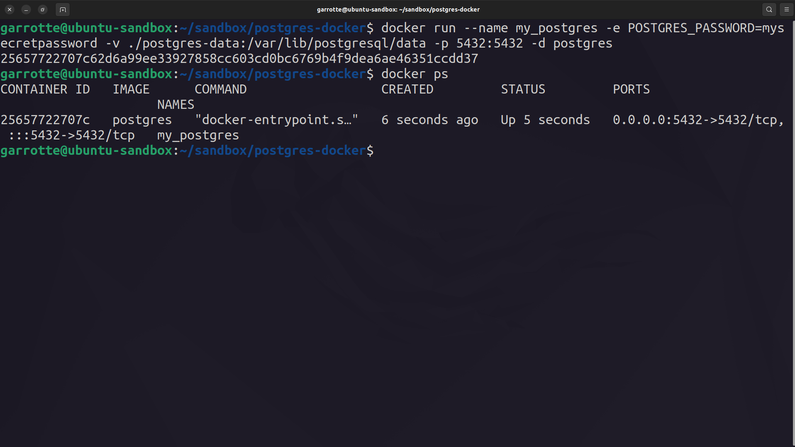
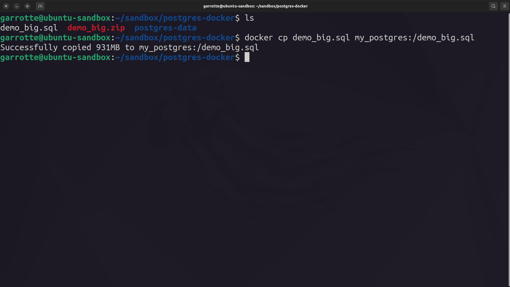
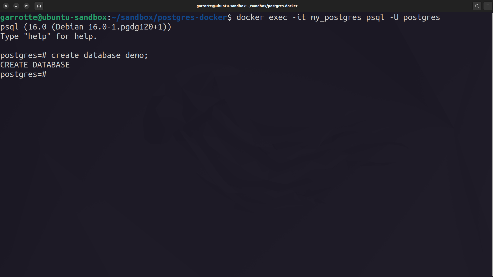
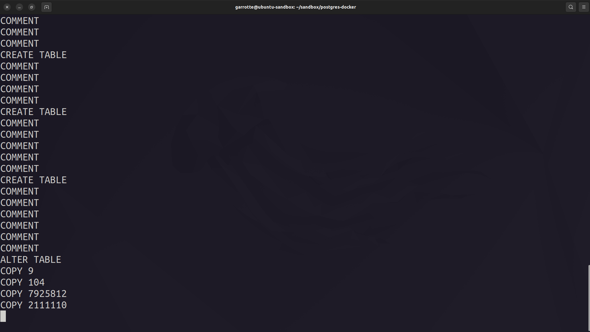
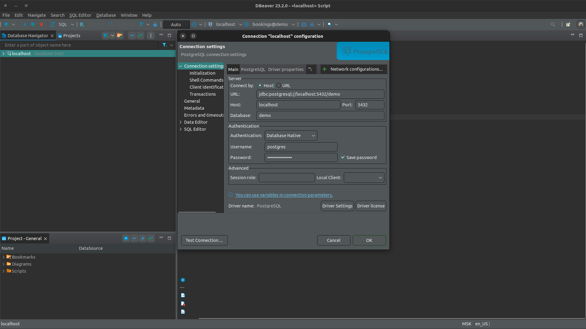
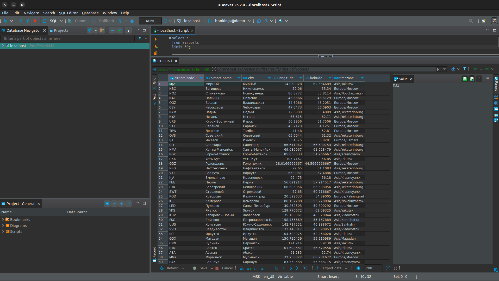

# MANUAL №0: Запуск Postgres c помощью Docker и импорт демонстрационной базы данных (без использования Dockerfile и docker-compose.yml)

###### Данную пошаговую инструкцию я пишу в первую очередь для себя, но возможно вам из этого что-то пригодится.

### 0. Установите Docker и скачайте демонстрационную базу данных:
- https://totaku.ru/ustanovka-docker-i-docker-compose-na-ubuntu-22-04/
- https://postgrespro.ru/docs/postgrespro/9.6/demodb-bookings-installation

### 1. Загрузите образ PostgreSQL из Docker Hub с помощью следующей команды в командной строке:
`docker pull postgres`

### 2. Создайте директорию на своей локальной машине, где будет храниться база данных PostgreSQL. Например, вы можете создать директорию с именем "postgres_data".

### 3. Запустите контейнер с помощью следующей команды, заменив <путь_к_директории> на путь к созданной директории:
`docker run --name my_postgres -e POSTGRES_PASSWORD=mysecretpassword -v <путь_к_директории>:/var/lib/postgresql/data -p 5432:5432 -d postgres`
###### Эта команда запускает контейнер с именем "my_postgres", устанавливает пароль для пользователя "postgres" в "mysecretpassword", привязывает порт 5432 контейнера к порту 5432 на вашей локальной машине и монтирует директорию <путь_к_директории> внутри контейнера для хранения данных. 
###### Монтировать директорию внутрь контейнера необходимо для того, чтобы ваши изменения сохранялись даже после остановки контейнера.

### 4. Подготовка базы данных: Убедитесь, что у вас есть резервная копия базы данных, которую вы хотите импортировать. Это может быть файл SQL или файл с расширением .dump.

### 5. Копирование файла в контейнер: Сначала скопируйте файл с резервной копией базы данных в контейнер Docker. Для этого вы можете использовать команду docker cp. Например, если ваш файл называется backup.sql и ваш контейнер PostgreSQL называется postgres-container, команда будет выглядеть следующим образом:
`docker cp backup.sql postgres-container:/backup.sql`

### 6. Создание базы данных: Теперь необходимо создать пустую базу данных, чтобы в неё можно было импорторивать скопированный нами файл. Сделать это можно следующим образом:
`docker exec -it postgres-container psql -U postgres`   
`CREATE DATABASE your_database_name;`

### 7. Импорт базы данных: После того, как файл скопирован в контейнер и создана пустая база данных, вы можете выполнить команду импорта базы данных внутри контейнера. Для этого войдите в контейнер с помощью команды docker exec -it, а затем выполните команду импорта. Например, если вы используете утилиту psql, команда может выглядеть следующим образом:
`docker exec -it postgres-container psql -U postgres -d your_database_name -f /backup.sql`
###### Здесь your_database_name - это имя вашей базы данных, а /backup.sql - путь к файлу резервной копии внутри контейнера.
###### База данных импортируется примерно так:

 
### 7. Проверка импорта: После завершения импорта вы можете проверить, что база данных была успешно импортирована.
###### Лично я использую dbeaver для подключения
###### Соединение:

###### Запрос:

---------------------------------------------
### P.S. В свободное время я постараюсь описать подробнее смысл монтирования директории, а далее я постараюсь заключить всю сборку в docker-compose.yml